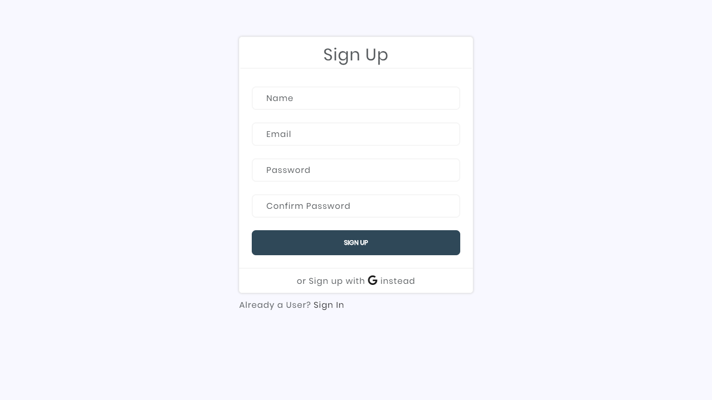
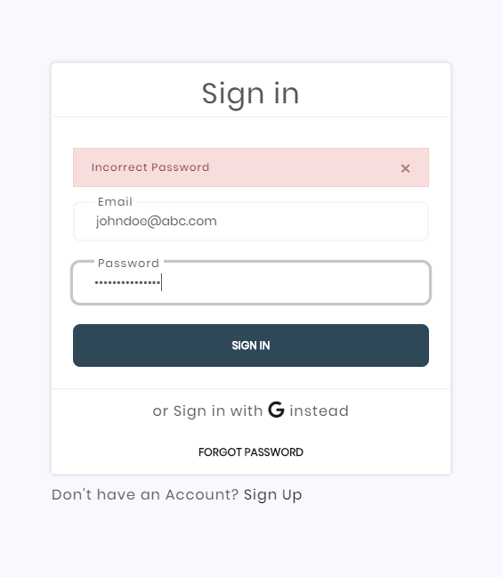
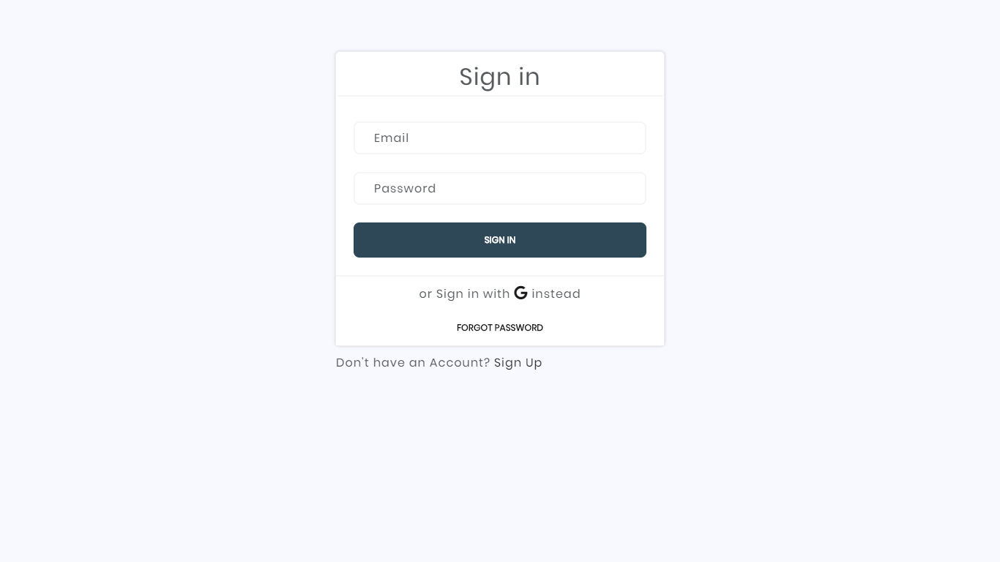
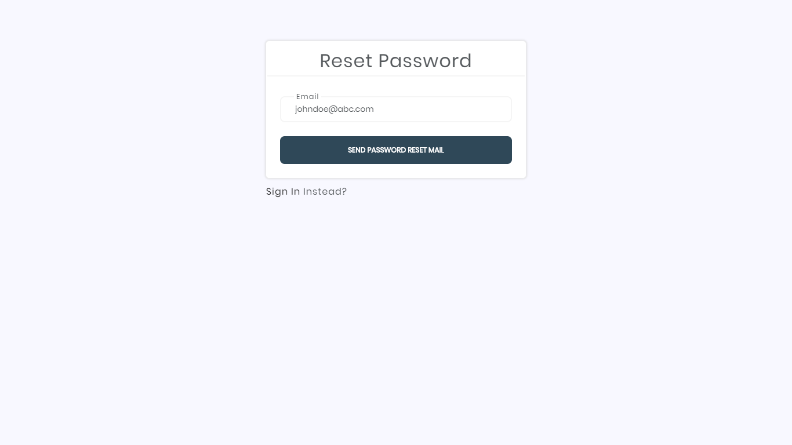
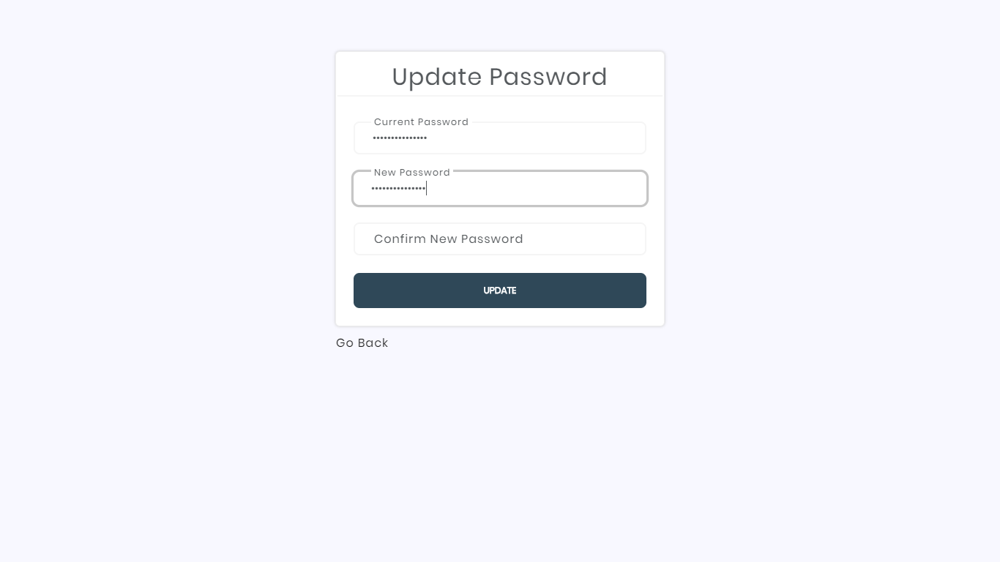

# Auth-app-passport.js
### Authentication Starter app using passport.js 
#### Google Oauth and Local Authentication

**Get Started**

`npm start`

**Get Started using nodemon**

`npm run dev`

**Add the following Keys**

MongoDB key `config/mongoose`

Google Oauth Client Secret and ID `config/passport-google`

Nodemailer API key `controllers/user-controller`

___
### Screenshots
   
   
   
